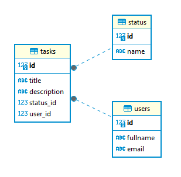

# Домашнє завдання до модуля “Вступ до вивчення систем управління базами даних” 

## Завдання 1

Створіть базу даних для системи управління завданнями, використовуючи PostgreSQL. База даних має містити таблиці для користувачів, статусів завдань і самих завдань. Виконайте необхідні запити в базі даних системи управління завданнями.

### Покрокова інструкція

1. Створіть таблиці у вашій PostgreSQL базі даних відповідно до вимог. Використовуйте належні типи даних та обмеження.

### Вимоги до структури бази даних:

**Таблиця** `users`:

- `id`: Первинний ключ, автоінкремент (тип `SERIAL`),
- `fullname`: Повне ім'я користувача (тип `VARCHAR(100)`),
- `email`: Електронна адреса користувача, яка повинна бути унікальною (тип `VARCHAR(100)`).

**Таблиця** `status`:

- `id`: Первинний ключ, автоінкремент (тип `SERIAL`),
- `name`: Назва статусу (тип `VARCHAR(50)`), повинна бути унікальною. Пропонуємо наступні типи `[('new',), ('in progress',), ('completed',)]`.

**Таблиця** `tasks`:

- `id`: Первинний ключ, автоінкремент (тип `SERIAL`),
- `title`: Назва завдання (тип `VARCHAR(100)`),
- `description`: Опис завдання (тип `TEXT`),
- `status_id`: Зовнішній ключ, що вказує на `id` у таблиці `status` (тип `INTEGER`),
- `user_id`: Зовнішній ключ, що вказує на `id` у таблиці `users` (тип `INTEGER`).



2. Переконайтеся, що поля `email` у таблиці `users` та `name` у таблиці `status` є унікальними.
3. Налаштуйте зв'язки між таблицями таким чином, щоб при видаленні користувача автоматично видалялися всі його завдання (каскадне видалення).
4. Напишіть скрипт створення цих таблиць.
5. Напишіть скрипт `seed.py` на Python, який буде заповнювати ці таблиці випадковими значеннями. Використовуйте бібліотеку Faker.
6. Використовуючи SQL, виконайте наступні запити в базі даних системи управління завданнями.

### Запити для виконання:

- **Отримати всі завдання певного користувача**. Використайте `SELECT` для отримання завдань конкретного користувача за його `user_id`.
- **Вибрати завдання за певним статусом**. Використайте підзапит для вибору завдань з конкретним статусом, наприклад, `'new'`.
- **Оновити статус конкретного завдання**. Змініть статус конкретного завдання на `'in progress'` або інший статус.
- **Отримати список користувачів, які не мають жодного завдання**. Використайте комбінацію `SELECT`, `WHERE NOT IN` і підзапит.
- **Додати нове завдання для конкретного користувача**. Використайте `INSERT` для додавання нового завдання.
- **Отримати всі завдання, які ще не завершено**. Виберіть завдання, чий статус не є `'завершено'`.
- **Видалити конкретне завдання**. Використайте `DELETE` для видалення завдання за його `id`.
- **Знайти користувачів з певною електронною поштою**. Використайте `SELECT` із умовою `LIKE` для фільтрації за електронною поштою.
- **Оновити ім'я користувача**. Змініть ім'я користувача за допомогою `UPDATE`.
- **Отримати кількість завдань для кожного статусу**. Використайте `SELECT`, `COUNT`, `GROUP BY` для групування завдань за статусами.
- **Отримати завдання, які призначені користувачам з певною доменною частиною електронної пошти**. Використайте `SELECT` з умовою `LIKE` в поєднанні з `JOIN`, щоб вибрати завдання, призначені користувачам, чия електронна пошта містить певний домен (наприклад, `'%@example.com'`).
- **Отримати список завдань, що не мають опису**. Виберіть завдання, у яких відсутній опис.
- **Вибрати користувачів та їхні завдання, які є у статусі `'in progress'`**. Використайте INNER JOIN для отримання списку користувачів та їхніх завдань із певним статусом.
- **Отримати користувачів та кількість їхніх завдань**. Використайте `LEFT JOIN` та `GROUP BY` для вибору користувачів та підрахунку їхніх завдань.

> 💡 Рекомендації до виконання:
> 
> Використовуйте ваші SQL-навички для формулювання й виконання кожного з цих запитів у вашій базі даних. 
> 
> Переконайтеся, що ви розумієте, як кожен запит працює, та які результати ви очікуєте отримати.
> 
> Для кращого розуміння спробуйте модифікувати запити або створити свої власні, ґрунтуючись на структурі бази даних.

### Критерії прийняття

1. Створено таблиці та виконано вимоги до структури бази даних.
2. Поля `email` у таблиці `users` та `name` у таблиці `status` є унікальними.
3. При видаленні користувача автоматично видаляються всі його завдання (каскадне видалення).
4. Написано скрипт створення таблиць.
5. Написано скрипт `seed.py` на Python, який буде заповнювати ці таблиці випадковими значеннями, з використанням бібліотеки Faker.
6. Виконано всі необхідні запити в базі даних системи управління завданнями.

## Завдання 2

Розробіть Python скрипт, який використовує бібліотеку PyMongo для реалізації основних CRUD (Create, Read, Update, Delete) операцій у MongoDB.

### Покрокова інструкція

1. Створіть базу даних відповідно до вимог.

### Вимоги до структури документа

Кожен документ у вашій базі даних повинен мати наступну структуру:
```
{
    "_id": ObjectId("60d24b783733b1ae668d4a77"),
    "name": "barsik",
    "age": 3,
    "features": ["ходить в капці", "дає себе гладити", "рудий"]
}
```

Документ представляє інформацію про кота, його ім'я `name`, вік `age` та характеристики `features`.

2. Розробіть Python скрипт `main.py` для виконання наступних завдань.

### Завдання для виконання:

**Читання (Read)**
- Реалізуйте функцію для виведення всіх записів із колекції.
- Реалізуйте функцію, яка дозволяє користувачеві ввести ім'я кота та виводить інформацію про цього кота.

**Оновлення (Update)**
- Створіть функцію, яка дозволяє користувачеві оновити вік кота за ім'ям.
- Створіть функцію, яка дозволяє додати нову характеристику до списку features кота за ім'ям.

**Видалення (Delete)**
- Реалізуйте функцію для видалення запису з колекції за ім'ям тварини.
- Реалізуйте функцію для видалення всіх записів із колекції.

> 💡 Рекомендації до виконання:
> 
> - Використовуйте MongoDB Atlas або локально встановлений екземпляр MongoDB за допомогою Docker.
> - Встановіть бібліотеку PyMongo через `pip` або інший пакетний менеджер, як `pipenv` чи `poetry`.
> - Не забудьте обробити можливі винятки при виконанні операцій з базою даних.
> - Переконайтеся, що ваші функції чітко коментовані та добре структуровані.
> - Заохочується використання Python віртуального середовища для ізоляції залежностей проєкту.

### Критерії прийняття
1. Створено базу даних та виконано вимоги щодо структури документів.
2. Реалізовано всі необхідні операції.
3. Оброблено можливі винятки при виконанні операцій з базою даних.
4. Функції чітко коментовані та добре структуровані.
